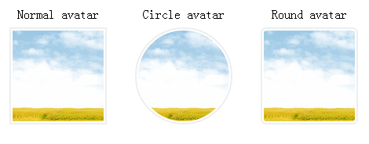
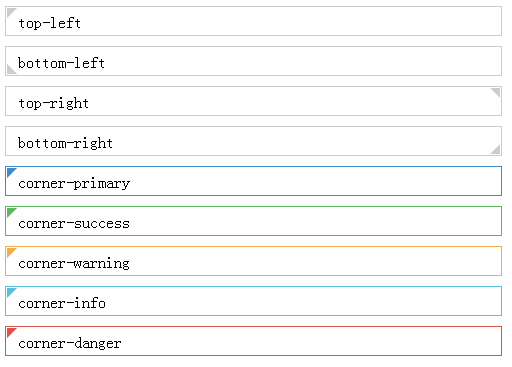
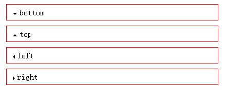

# css3

- [Image mask](https://rawgit.com/get-started/css3/master/examples/mask.html)

  

- [Avatar](https://rawgit.com/get-started/css3/master/examples/avatar.html)

  

- [Corner](https://rawgit.com/get-started/css3/master/examples/corner.html)

  

- [Caret](https://rawgit.com/get-started/css3/master/examples/caret.html)

  
